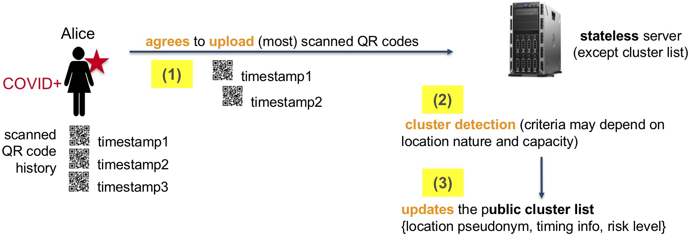

# The Cluster Exposure Verification (Cléa) Protocol: Specifications of the Lightweight Version

Vincent Roca, Antoine Boutet, Claude Castelluccia

PRIVATICS team, Inria, France

{firstname.lastname}@inria.fr

**_Preliminary Draft (Work in Progress), current version, March 31st, 2021_**


----

[comment]: # ( [[_TOC_]] )
[comment]: # ( ———— )


[[_TOC_]]

----


## 1- Introduction

This document specifies the Cluster Exposure Verification (Cléa) protocol meant to warn the participants of a private event (e.g., wedding or private party) or the persons present in a commercial or public location (e.g., bar, restaurant, sport center, or train) that became a cluster because a certain number of people who were present at the same time have been tested COVID+.

It is based: (1) on a central server, under the responsibility of an authority (e.g., a health authority), that performs an automatic and centralized cluster detection; (2) on the display a QR code at the location, either in a dynamic manner (e.g., via a dedicated device, smartphone, or tablet) or static manner (e.g., printed); and (3) on a smartphone application used by people present at the location.
This smartphone application enables to scan this QR code when entering the location, to store it locally (encrypted) for the next 14 days, and to perform periodic risk analyses, in a decentralized manner, after downloading information about the new clusters.

In order to enable a decentralized risk analysis, information about clusters (i.e., the location pseudonyms and cluster timing information) needs to be disclosed.
We believe this is an acceptable downside because this information is not per se sensitive health data (it does not reveal any user health information to an eavesdropper), although it can be considered as personal data (it is indirectly linked to the location manager).

This protocol is also meant to be used by the location employees in order to warn them if their work place is qualified as cluster, or on the opposite to let them upload information to the server if they are tested COVID+.


## 2- Cléa protocol high level principles

### 2.1- Terminology

The following terms are used in this document:

| Name                     | Description                                                                     |
|--------------------------|---------------------------------------------------------------------------------|
| **Location**       |	synonymous to venue, this is a closed area where people meet. It can be a private venue (e.g., for a wedding or a party) or a commercial or public venue (e.g., a bar, a restaurant, a sport center, an entertainment hall or auditorium, a train). |
| **Device**         |	a specialized device or a general purpose smartphone or tablet with the appropriate software, used by the location manager or event organizer, that displays a QR code. |
| **Period**         |	time is split into periods (e.g., 24 hours), during which the location pseudonyms (more precisely a temporary cryptographic key and a derived temporary UUID) are stable. After that period, a new location pseudonym is generated. For practical reasons, a new period MUST start at a round predefined hour (e.g., 4:00am may be chosen as a default period start). A period can also have an unlimited duration, meaning that the location pseudonym will remain unchanged. |
| **(User) terminal**|	the user smartphone used to scan the QR code. |
| **Cléa application** | the application on the user smartphone used to scan the QR code. |
| **QR code** | The QR code of a location, usually dynamic, that needs to be scanned when entering a location. It contains a URL ("deep link") structured as: `"country-specific-prefix" / "Base64(location-specific-part)"`. |
| **Location Specific Part**  | This is the location specific part of a the QR code, renewed periodically, that contains all the information related to the location, at a given time. |

### 2.2- Overview

This protocol must comply with two privacy-related requirements:

- the location manager must not be able to collect any data with respect to the clients (unlike written records where clients fill-in their name and contact information), and
- the amount of information uploaded by the Cléa application to the central server must be minimized.

In practice, no information is uploaded to the server unless a client is tested COVID+.
In that case, if the user explicitly agrees (informed consent), the application uploads the list of scanned QR codes during the past 14 days[^footnote-1] along with timing information to the central server, in order to enable a **_centralized anonymous cluster detection_**.
The server can detect clusters by considering the number of COVID+ users in  a location at the same time, without having access to the name nor address of this location.
Then this central server updates its list of location temporary pseudonyms and time (with an hour granularity by default) corresponding to clusters.

    

_Figure 1: Centralized cluster detection. Here Alice, tested COVID+, agrees to upload her scanned QR codes to the CLEA backend server, which, after verifying the validity of the upload, identifies if some of the visited locations needs to be qualified as potential cluster._    


In parallel, each Cléa application periodically downloads this list containing the latest clusters that have been identified, in order to check locally whether or not there is a match.
In case of a match, the user is informed with a "warning".
The exact type of warning message could be adjusted to reflect the risk level (e.g., if a very high number of COVID+ users have been identified in a cluster), which is out of scope of the present specification.
Therefore this solution follows a **_decentralized risk evaluation_**.

    

_Figure 2: Decentralized risk evaluation. Here Bob compares his scanned QR codes with the new potential cluster location pseudonyms in a first step, and if a match is found, if the corresponding period overlaps significantly with his own presence as stored in his local database._    

[^footnote-1]: the 14 days number is provided as an example. The national health authority will define the appropriate epidemiological value that is considered the most appropriate, that may also depend on another considerations like the date of first symptoms when known. The details are out of scope of this document.

We believe that making public the list of location temporary UUIDs and time corresponding to clusters is an acceptable tradeoff, because this information is not per se sensitive health data (it does not reveal any user health information to an eavesdropper), although it can be considered as personal data (it is associated to the location manager)[^footnote-2].

[^footnote-2]: This is a big difference with a decentralized contact tracing system, for instance based on the Google/Apple Exposure Notification (GAEN) component, where the pseudonyms of COVID+ users are freely available over the Internet. In that case, revealing this sensitive health data enables any curious neighbour who uses a dedicated BLE scanning system (and [https://coronadetective.eu](https://coronadetective.eu) has shown how trivial this can be since a web browser is sufficient) to immediately identify the health status of their neighbours if they upload their pseudonyms later on, with potentially major discrimination consequences. A centralized scheme should be used for contact tracing for privacy purposes in countries where citizens can trust their institutions and their Data Protection Agency, for GDPR compliance reasons. With the present specification, on the opposite, a decentralized risk evaluation approach makes sense as it does not disclose sensitive information per se.

In order to further improve privacy and security considerations, the current specification relies on dynamic QR codes that are periodically renewed and displayed with the help of a dedicated physical device.
Each QR code includes, among other things, the location temporary UUID (behaving as a temporary pseudonym) that typically changes at least once a day (another period is possible, as explained later).

The current specification can also be used with static QR codes (e.g., printed on paper and made available to clients) if a location does not own a dedicated physical device.
Being static, this solution has downsides: it is less robust in front of relay attacks, and it enables an attacker to display all the clusters on a map (since the location UUIDs will not frequently change over time, it is relatively easy to collect them) or to focus on a specific set of locations to know if they are cluster.
A good practice is to regularly change the QR codes, in particular if the location is identified as a cluster.
This aspect is out of scope of the present specification.
It can also be noticed that both systems can nicely cohabit, on the same Cléa application, using the same protocol and central server.

Finally the employees of a location can benefit from the service, in order to be warned if their workplace is a cluster, or on the opposite to upload to the server that they have been tested COVID+.
Since they have a long presence in the location, the employees must scan a specific QR code which differs from regular QR codes scanned by clients.


### 2.3- Attacker model and trust considerations

This specification considers two different types of attackers.
The first type is composed of individuals who try to corrupt the service, deny the service, or break the confidentiality of the service.

In the second type, the authority that operates the Cléa system, tries to reidentify the users and know as much as possible on the users.
The system is expected to be audited by an external trusted authority (e.g., a national Data Protection Agency, like CNIL in case of France).
Because of these audits, this authority is assumed to be curious but honest.
It means the authority in charge of the server will not try to modify the Cléa protocol itself, nor the implementation of the Cléa protocol, since this would be detected by the external trusted authority.
However, it may benefit from the recorded information to infer additional information or use it for different purposes.

It follows that the Cléa server should be split into several independent entities: a front end that collects the traffic from the Cléa users and sanitizes the traffic, removing the source IP address for instance, "on-the-fly", without storing any piece of information beyond what is strictly required (care should be put to logs for instance).
On the opposite, the back end only processes messages that have been sanitized by the front end.
The backend may also leverage from specific hardware for storing system keys, in order to minimize the security risks in case of intrusion.

On the opposite, the Cléa system assumes that the authority in charge of the Manual Contact Tracing is trustworthy when it comes to dealing with personal data, for instance when a manual contact tracing team contact a location manager or event organizer, not to take advantage of the information collected beyond what is strictly required to perform its task.
However this authority must not be involved in the cluster detection process, that is not under its responsibility.

These considerations has impacted the Cléa design as explained in this document.
It should be noted that technical implementation considerations (e.g., the exact design of the Cléa server) are out of scope of the present document.


### 2.4- Technical requirements

Several technical requirements, in particular motivated by the compatibility with embedded devices, have shaped the design:

- each QR code contains a country specific URL ("deep link"), composed of a contry specific prefix (for instance: `https://tac.gouv.fr/` in case of France), and a location specific part, defined in Section [Dynamic QR code generation within the device](#dynamic-qr-code-generation-within-the-device).
Therefore, any binary information of the location specific part, is first translated to a printable character, using a Base64 encoding, which adds a 33% overhead compared to the binary size (see [RFC4648](#references)).
Since the output of a Base64 encoding uses an alphabet of 65 characters, it is not compatible with the Alphanumeric Mode of a QR code (limited to 45 printable characters), and it requires the use of the 8-bit Byte Mode (see [QRcode18004](#references), Section~8.4.4).

- the need to easily and reliably scan a QR code type 2 and the screen size/resolution constraints of the specialized device impact the maximum QR code size.
In this specification, we limit the size of the QR code to be 65x65, using a Level 12 QR code Type 2 (see [QRcodeWeb](#references)).
With this level, using the 8-bit byte mode, the information size to be between 155 and 367 binary characters, depending on the chosen redundancy.
Given the size of data to be embedded in the QR code, the redundancy is set to the Medium level, leaving a maximum of 287 characters for the URL.
If the URL is shorter (e.g., when `locContactMsg` is absent, see below), the redundancy is set to Q level, leaving a maximum of 203 characters for the URL.

- a specialized device is typically not connected to the Internet nor any wireless network, it does not feature any connector (no USB), is powered by a non-rechargeable battery, in a fully autonomous manner (no power plug, an autonomy of several months is expected).

- a specialized device features a dedicated microcontroller (e.g., a MICROCHIP microcontroller, PIC32MM0256GPM036-I/M2). 
This embedded platform has low computation capabilities, which limits the QR code renewal period.
Power consumption also limits the QR code renewal period.

- a dedicated tablet could easily remove some of the above limitations, but on the other hand a tablet is more costly, is subject to theft, and is subject to attacks, being connected. It is therefore a potential target device for displaying dynamic QR codes, but not the privileged one.


## 3- Detailed operational description

### 3.1- Acronyms

The following acronyms and variable names are used:

| Short name     | Full Name                 | Description                                        |
|----------------|---------------------------|----------------------------------------------------|
| `LSP`          | locationSpecificPart      | The QR code of a location, at any moment, contains a URL ("deep link"), structured as: `"country-specific-prefix" / "Base64(location-specific-part)"`. The location specific part, renewed periodically, contains information related to the location at a given time. |
| `SK_L`      | permanentLocationSecretKey     | Permanent location 408-bits secret key. This key is never communicated, but is shared by all the location devices. For instance, this key can be stored in a protected stable memory of a dedicated device (or set of devices) by the manufacturer. The manufacturer should also keep a record of this `SK_L` in a secure place if the location manager later asks for additional devices. An appropriate location manager authentication mechanism needs to be defined for that purpose that is out of the scope of this document. |
| `{PK_SA, SK_SA}` | serverAuthorityPublicKey / SecretKey | Public/secret key ECDH pair of the Authority in charge of the backend server. The public key is known by all devices. |
| `{PK_MCTA, SK_MCTA}` | manualCTAuthorityPublicKey / SecretKey | Public/secret key ECDH pair of the Authority in charge of the manual contact tracing. The public key is known by all devices. It is assumed that this authority is different from the authority in charge of the backend server. |
| `LTKey`     | locationTemporarySecretKey     | Location temporary 256-bits secret key, specific to a given Location at a given period. This key is never communicated outside of the device(s). |
| `LTId`      | locationTemporaryPublicID      | Location temporary public universally unique 128-bits Identifier (UUID), specific to a given location at a given period. This public location identifier is derived from the associated secret location key. |
| `t_periodStart` (in seconds) | periodStartingTime | Starting time of the period, expressed as the number of seconds since January 1st, 1900 (NTP timestamp limited to the 32-bit seconds field), by convention in the UTC (Coordinated Universal Time) timezone. A period necessarily starts at a round hour. |
| `ct_periodStart` | compressedPeriodStartingTime   | Compressed form of the period starting time, obtained by dividing `t_periodStart` by 3600, which is guaranteed to be an integral value since a period necessarily starts at a round hour (i.e., is multiple of 3600). |
| `periodDuration` (in hours) | idem           | Duration of the period, expressed as the number of hours. This duration is transmitted in a 1-byte field. Value 0 is invalid and should not be used, values between 1 and 254 inclusive indicate a period duration of 254 hours (i.e., 10 days and 14 hours), value 255 is reserved to the special case of an unlimited period duration. The default value is 24 hours (a period per day), but different values may be defined.
| `qrCodeRenewal Interval` (in seconds) | idem  | QR codes renewal interval. QR codes are renewed every `qrCodeRenewalInterval` seconds, a value of 0 indicating the QR code is never renewed during the period. This value is chosen by the device and communicated within the QR code as a power of 2, via the `CRIexp` field. |
| `CRIexp` | qrCodeRenewalIntervalExponent     | Compact version of the `qrCodeRenewalInterval` as the exponent of a power of two, coded in 5 bits. When equal to `0x1F`, `qrCodeRenewalInterval` must be set to `0` (i.e. no renewal period), otherwise `qrCodeRenewalInterval` must be set to `2^^CRIexp` seconds. |
| `t_qrStart` (in seconds) | qrCodeValidityStartingTime | Starting time of the QR code validity timespan, expressed as the number of seconds since January 1st, 1900 (NTP timestamp limited to the 32-bit seconds field), by convention in UTC (Coordinated Universal Time) timezone. |
| `t_qrScan` (in seconds) | qrCodeScanTime     | Timestamp when a user terminal scans a given QR code, expressed as the number of seconds since January 1st, 1900 (NTP timestamp limited to the 32-bit seconds field), by convention in UTC (Coordinated Universal Time) timezone. |
| `localList` | idem                           | Within the user terminal, this list contains all the `{QR code, t_qrScan}` tuples collected by a user within the current 14-day window. Entries are added in this localList as the user visits new locations and scans the corresponding QR code, and automatically deleted after 14 days. |
| `clusterList` | idem                         | Within the backend server, this list contains all the `LTId` and timing information corresponding to a potential cluster. This list is public, it is downloaded by all the user terminals, and is updated each time a new cluster is identified. The cluster qualification happens when the hourly counter of a location exceeds a given threshold that depends on the location features. |
| `dupScanThreshold` (in seconds) | idem       | Time tolerance in the duplicate scan mechanism: for a given `LTId`, a single QR code can be recorded in the localList every `dupScanThreshold` seconds. A similar check is performed on the server frontend. |
| `locationPhone` | idem                       | Phone number of the location contact person, stored as a set of 4-bit sub-fields that each contain a digit. This piece of information is only accessible to the manual contact tracing authority. It is meant to create a link between the digital system and the hand-written attendance register. |
| `locationRegion` | idem                      | Coarse grain geographical information for the location, in order to facilitate the work of the Manual Contact Tracing team. In case of France, it can contain a department number. |
| `locationPIN` | idem                         |  Secret 6 digit PIN, known only by the location contact person, stored as a set of 4-bit sub-fields that each contain a digit. This piece of information is only accessible to the manual contact tracing authority. It is meant to create a link between the digital system and the hand-written attendance register. |


### 3.2- Initial configuration of the device(s) at the manufacturer (specialized device) or location (tablet)

The following rules apply to the configuration of the device(s) of a given location:

- The location keeps a long-term secret, `SK_L`, specific to this location, that is never communicated.
If this location uses several devices, each of them must be configured with this same `SK_L`.
This configuration can be done by the device manufacturer meaning that the manufacturer is in charge of keeping this long-term secret. Details are out of the scope of this document.

- Each device knows the public key of the Authority in charge of the backend server, `PK_SA`, and the public key of the Authority in charge of manual contact tracing, `PK_MCTA`.

- If the location has several totally independent rooms (e.g., a restaurant across two different buildings), distinct devices initialized with different long-term secrets, `SK_R1` and `SK_R2`, may be used in order to generate different location keys and identifiers.

- A pre-determined round hour (e.g., 4:00am, local timezone) is defined, that ideally corresponds to a moment when this location is closed.
At that hour, every day, the location `LTKey` and `LTId` are automatically renewed.
Later, if the authority identifies a cluster in this location, it will be notified through this location temporary UUID, known only by the clients of the location who scanned the associated QR code.

- The case of a location that never closes should be handled in the most appropriate manner, for instance with a location key and identifier renewal that corresponds to a low affluence period.
The motivation is to reduce the risk that a client who arrives just after the location key and identifier renewal (who learns the new `LTId_{i+1}` via the new QR code) be not informed of a cluster warning for this location for a cluster time span that starts just before the renewal, since this later may be associated to the previous `LTId_i`.

- The case of a long event (e.g., over several days) requires specific attention.
For instance, it can be a public or private event gathering several persons in a closed location during more than one day (e.g., a marriage or party over a week-end), with people who may only arrive on the second day, or leave earlier, or stay during all the event.
Such events are incompatible with a daily renewal of the location key and identifier, since obliging all users to scan the new QR code after each renewal can be impractical.
Having the location key and identifier lasting the full duration of the event can be a practical solution.
Then, since the exact moment when a participant definitively leaves the event is unknown by default, it can be preferable to use a coarse grain warning during the risk evaluation process.

- A period can also be shorter than 24 hours, when several activity periods are clearly defined, each of them separated by official closures of the location (e.g., the two services of a restaurant, at noon and in the evening).
It is then possible to configure all the devices of the location with two or more renewal round hours (e.g., by the manufacturer).
Those shorter periods are managed exactly in the same manner without any impact on the present specification.
The main benefit of shorter periods is to avoid that a client of the noon service of a restaurant learns the potential cluster status of this location for the evening service, since this client will not know the new `LTId` used in the evening.

- The `periodDuration` parameter contains the chosen period duration, expressed in number of hours, between 1 and 255 (note that value 0 is invalid), the value 255 being reserved to the special case of a unlimited period duration. 
It is part of the information carried in the QR code and it is used by the server.
This `periodDuration` determines the renewal frequency of the location temporary key and identifier.
It is therefore a key parameter that defines the robustness against attackers who want to monitor the potential cluster status of a set of locations in the long term.

- An appropriate value for the `qrCodeRenewalInterval` parameter (duration after which a QR code is renewed) is chosen, depending on the device specifications and the desired protection against relay attacks. A value of 0 indicates the QR code is never renewed during the period, otherwise `qrCodeRenewalInterval` must be equal to a power of two.
A default value is: `2^^10 = 1024 seconds` (approx. 17 minutes).


### 3.3- Location Temporary Key (LTKey) and UUID (LTId) generation within the device

**_Step 1: key generation:_**
A temporary key is generated for the location, which is automatically renewed (by default once a day) at a predefined round hour (e.g., at 4:00 am) which ideally corresponds to a closing time of the location.
For the given period, this key is computed as follows:
```
	LTKey(t_periodStart) = SHA256(SK_L | t_periodStart)
```
where `t_periodStart` is the reference timestamp for the beginning of the period, in NTP format (number of seconds since January 1, 1900).
The `t_periodStart` value must match the predefined round hour: it cannot just be the result of a `gettimeofday()` (or similar) converted to an NTP time, a rounding to the nearest predefined round hour is necessary.
For instance, 3h59mn48s and 4h00mn31s are both rounded to the same 4h00mn00 `t_periodStart` value, that is also necessarily multiple of 3600 seconds.

**_Step 2: UUID generation:_**
In order not to communicate this key in clear text to the clients, the device derives the following UUID from it:
```
	LTId(t_periodStart) = HMAC-SHA-256-128(LTKey(t_periodStart), "1")
```
where HMAC-SHA-256-128 denotes the Keyed-Hash Message Authentication Code (HMAC) in conjunction with the SHA-256 cryptographic hash function and whose output is truncated to 128 bits, as defined in **[RFC4868](https://tools.ietf.org/html/rfc4868)** and **[RFC2104](https://tools.ietf.org/html/rf2104)**.

Indeed, an attacker who scans a QR code must not know the `LTKey(t_periodStart)` key in order to prevent him from being able to forge a new QR code in place of the device.

If there are several devices, each of them must generate the same `LTKey(t_periodStart)` and `LTId(t_periodStart)` when switching to a new period.
This is guaranteed if the same `t_periodStart` value is generated.
Renewal at a pre-defined full hour associated with a limited drift of the boxes (e.g., one or two minutes per year) guarantees this.
Since the devices are not perfectly synchronized (device clock drifts), a small hazard is possible (i.e., some devices will still display the old QR code and others the new one), but without any consequence if the location is closed to public at that moment.


### 3.4- Dynamic QR code generation within the device

**_Principles:_**

The QR code of a location, at any moment, contains a URL ("deep link"), structured as:
```
	"country-specific-prefix" / "Base64(location-specific-part)"
```
For instance, the country specific prefix is: `https://tac.gouv.fr/` in case of France.
This section defines the structure of the location specific part.

The QR code of a location is renewed when switching from one period to another (change of `LTKey`/`LTId`), but also periodically during the period.
This renewal during the period is automatic every `qrCodeRenewalInterval` seconds.
This QR code renewal interval is a balance between the calculation and/or autonomy constraints of the device on the one hand (the higher the `qrCodeRenewalInterval` value, the better), and the desired protection against relay attacks that would otherwise be possible during the entire period on the other hand (the lower, the better, see below).
Note that if there are several devices, an asynchronism between them during the renewal of the QR code does not pose a problem: the `t_qrStart` values may differ, only the `LTId(t_periodStart)` must be identical across all QR codes, which is guaranteed.


In the current specification (corresponding to protocol version 0), a single `location-specific--part` (identified as type 0) is defined.
More precisely, it is structured as follows (high-level view):
```
	LSP(t_periodStart, t_qrStart) = [ version | type | padding | LTId(t_periodStart)
		| Enc(PK_SA, msg) ]
```
where:
```
	msg = [ staff | locContactMsgPresent | countryCode | CRIexp | venueType | venueCategory1 | 
		| venueCategory2 | periodDuration | ct_periodStart | t_qrStart | LTKey(t_periodStart)
		| Enc(PK_MCTA, locContactMsg) if locContactMsgPresent==1 ]
```

The various fields are described below.
The `Enc(PK_MCTA, locContactMsg)` is defined in section ["A user tested COVID+ has used the Cléa system"](#a-user-tested-covid-has-used-the-cléa-system).


**_Binary format of the location-specific-part_**

The following binary format must be used for the location specific part:
```
 0                   1                   2                   3
 0 1 2 3 4 5 6 7 8 9 0 1 2 3 4 5 6 7 8 9 0 1 2 3 4 5 6 7 8 9 0 1 
+-+-+-+-+-+-+-+-+-+-+-+-+-+-+-+-+-+-+-+-+-+-+-+-+-+-+-+-+-+-+-+-+
| ver | type|pad|        ...                                    |
+-+-+-+-+-+-+-+-+-+-+-+-+-+-+-+-+-+-+-+-+-+-+-+-+-+-+-+-+-+-+-+-+
|       ...                                                     |
+-+-+-+-+-+-+-+-+-+-+-+-+-+-+-+-+-+-+-+-+-+-+-+-+-+-+-+-+-+-+-+-+
|       ...            LTId (16 bytes)                          |
+-+-+-+-+-+-+-+-+-+-+-+-+-+-+-+-+-+-+-+-+-+-+-+-+-+-+-+-+-+-+-+-+
|       ...                                                     |
+-+-+-+-+-+-+-+-+-+-+-+-+-+-+-+-+-+-+-+-+-+-+-+-+-+-+-+-+-+-+-+-+
|       ...                                                     |
+-+-+-+-+-+-+-+-+-+-+-+-+-+-+-+-+-+-+-+-+-+-+-+-+-+-+-+-+-+-+-+-+
|       ...     |    Enc(PK_SA, msg) (variable size...)         |
+-+-+-+-+-+-+-+-+-+-+-+-+-+-+-+-+-+-+-+-+-+-+-+-+-+-+-+-+-+-+-+-+
.                                                               .
.                                                               .
.                                                               .
+-+-+-+-+-+-+-+-+-+-+-+-+-+-+-+-+-+-+-+-+-+-+-+-+-+-+-+-+-+-+-+-+
```

The following binary format for the `msg` message must be used:
```
 0                   1                   2                   3
 0 1 2 3 4 5 6 7 8 9 0 1 2 3 4 5 6 7 8 9 0 1 2 3 4 5 6 7 8 9 0 1 
+-+-+-+-+-+-+-+-+-+-+-+-+-+-+-+-+-+-+-+-+-+-+-+-+-+-+-+-+-+-+-+-+
|S|C|      countryCode      | CRIexp  |  vType  | vCat1 | vCat2 |
+-+-+-+-+-+-+-+-+-+-+-+-+-+-+-+-+-+-+-+-+-+-+-+-+-+-+-+-+-+-+-+-+
|periodDuration |           ct_periodStart (3 bytes)            |
+-+-+-+-+-+-+-+-+-+-+-+-+-+-+-+-+-+-+-+-+-+-+-+-+-+-+-+-+-+-+-+-+
|                    t_qrStart (4 bytes)                        |
+-+-+-+-+-+-+-+-+-+-+-+-+-+-+-+-+-+-+-+-+-+-+-+-+-+-+-+-+-+-+-+-+
|                     LTKey (32 bytes)                          |
+-+-+-+-+-+-+-+-+-+-+-+-+-+-+-+-+-+-+-+-+-+-+-+-+-+-+-+-+-+-+-+-+
|       ...                                                     |
+-+-+-+-+-+-+-+-+-+-+-+-+-+-+-+-+-+-+-+-+-+-+-+-+-+-+-+-+-+-+-+-+
|       ...                                                     |
+-+-+-+-+-+-+-+-+-+-+-+-+-+-+-+-+-+-+-+-+-+-+-+-+-+-+-+-+-+-+-+-+
|       ...                                                     |
+-+-+-+-+-+-+-+-+-+-+-+-+-+-+-+-+-+-+-+-+-+-+-+-+-+-+-+-+-+-+-+-+
|       ...                                                     |
+-+-+-+-+-+-+-+-+-+-+-+-+-+-+-+-+-+-+-+-+-+-+-+-+-+-+-+-+-+-+-+-+
|       ...                                                     |
+-+-+-+-+-+-+-+-+-+-+-+-+-+-+-+-+-+-+-+-+-+-+-+-+-+-+-+-+-+-+-+-+
|       ...                                                     |
+-+-+-+-+-+-+-+-+-+-+-+-+-+-+-+-+-+-+-+-+-+-+-+-+-+-+-+-+-+-+-+-+
|       ...                                                     |
+-+-+-+-+-+-+-+-+-+-+-+-+-+-+-+-+-+-+-+-+-+-+-+-+-+-+-+-+-+-+-+-+
|        Enc(PK_MCTA, locContactMsg) (65 bytes, if C==1)        |
+-+-+-+-+-+-+-+-+-+-+-+-+-+-+-+-+-+-+-+-+-+-+-+-+-+-+-+-+-+-+-+-+
.                                                               .
.                                                               .
.                                                               .
+-+-+-+-+-+-+-+-+-+-+-+-+-+-+-+-+-+-+-+-+-+-+-+-+-+-+-+-+-+-+-+-+
|       ...     |
+-+-+-+-+-+-+-+-+
```

The "big endianness" (also called "network endianness" with the Internet protocol suite), transmitting the most significant byte first, must be used whenever meaningful.
The location specific part contains (in plaintext or encrypted) the following fields, in this order:

- `version` (3 bits) (`ver` in figure):
this is the protocol version number, in order to enable an evolution of the protocol. The present specification corresponds to protocol version 0.

- `LSPtype` (3 bits) (`type` in figure):
this is the LSP type, in order to be able to use multiple formats in parallel in the future.
If several types are to be defined, the specification will have to clarify which protocol version supports which type.
In the current specification, only LSP type 0 is defined.

- `padding` (2 bits) (`pad`in figure):
this field is unused in the current specification and must be set to zero.

- `LTId` (16 bytes, or 128 bits): 
this field carries the location temporary UUID for the period.

- `staff` (1 bit) (`S` in figure):
this field, when equal to 0, indicates a regular QR code, for regular users, and when equal to 1, indicates a QR code specific to a staff member of the location.

- `locContactMsgPresent` (1 bit) (`C`in figure):
this field, when equal to 1, indicates the `locContactMsg` is used and present in the QR code, and when equal to 0, indicates it is absent.
It follows that the `msg` size can largely vary, depending on the use or not of a `locContactMsg`.

- `countryCode` (12 bits):
this field contains a country code, coded as the ISO 3166-1 country code of each of the 249 countries (see [List of ISO 3166 country codes](#references)).
The 3 digits are coded one by one, each digit in a different 4-bit nibble.
For instance `0x250` is used in case of France.

- `CRIexp` (5 bits):
this field enables to communicate the `qrCodeRenewalInterval` value in a compact manner, as the exponent of a power of two.
If this field contains the value `0x1F` (maximum value for a 5 bit field), `qrCodeRenewalInterval` must be set to `0` in order to indicate the QR code will not be renewed during the whole period (no QR code renewal).
Otherwise, `qrCodeRenewalInterval` must be set to the value `2^^CRIexp` seconds.
It follows that:
```
	qrCodeRenewalInterval = (CRIexp == 0x1F) ? 0 : 2^^CRIexp; // value in seconds
```
It means the QR code renewal will happen after an interval that is comprised between `1` and `2^^30` seconds inclusive, or never (if `qrCodeRenewalInterval == 0`).
Of course, a new QR code must be generated at the start of a new period (because the `LTKey` and `LTId` fields change) even if the `qrCodeRenewalInterval` is not finished.

- `venueType` (5 bits) (`vType` in figure):
this field specifies the type of the location/venue (e.g., a restaurant).
The encoding is country specific (for instance, for France, it can be mapped to the [Types d'ERP](https://www.service-public.fr/professionnels-entreprises/vosdroits/F32351) classification).

- `venueCategory1` (4 bits) (`vCat1` in figure):
this field specifies a first level of venue category. This is an opaque field whose semantic is out of scope of the present document.

- `venueCategory2` (4 bits) (`vCat2` in figure):
this field specifies a second level of venue category. This is an opaque field whose semantic is out of scope of the present document.

- `periodDuration` (1 byte):
this field contains the duration, in terms of number of hours, of the period.
Since this period duration is location dependent, this information needs to be communicated to the server.
The value 255 is reserved to the special case of an unlimited period duration.
The default value is 24 hours (a period per day), but different values may be defined up to a maximum of 254 hours (i.e., 10 days and 14 hours).

- `ct_periodStart` (24 bits):
this field contains the starting time of the period in a compressed manner, dividing `t_periodStart` by 3600, which is guaranteed to be an integral value since a period necessarily starts at a round hour (i.e., is multiple of 3600).
It follows that:
```
	t_periodStart = ct_periodStart * 3600;
```

- `t_qrStart` (32 bits):
this field contains the starting time of the QR code validity timespan, expressed as the number of seconds since January 1st, 1900 (NTP timestamp limited to the 32-bit seconds field).

- `LTKey` (32 bytes, or 256 bits):
this field carries the location temporary key for the period.

The `msg` message must be encrypted using the ECIES-KEM **[ISO18033-2] [Shoup2006] [Libecc]** hybrid encryption scheme that provides both confidentiality, using an asymmetric encryption scheme, and integrity verification.
This scheme is implemented using SECP256R1 ECDH as KEM, KDF1 using SHA256 hash as KDF and AES-256-GCM with a fixed 96-bits IV as DEM and TAG. A detailed description of the `Enc` function is given in appendix A

**_QR code size:_**

For the LSP type 0 specified in this document, the plain text part is 17 bytes long.

The `msg` message, without taking `Enc(PK_MCTA, locContactMsg)` into account (or when absent), is 44 bytes long.
The hybrid ECIES-KEM adds an overhead of 49 bytes (see [Description of the hybrid encryption scheme and the Enc and Dec functions](#a-description-of-the-hybrid-encryption-scheme-and-the-enc-and-dec-functions)), for a total of 93 bytes.

When the `locContactMsgPresent == 1`, the `locContactMsg` message adds an extra 16 bytes, as well as the same 49-byte overhead for the hybrid ECIES-KEM encryption, for a total of 65 bytes.

The total is therefore 175 bytes long with the `locContactMsg`, or 110 bytes long without.

The size of this binary message, after Base64 encoding, increases to 235 characters that can be added to the example `https://tac.gouv.fr/` 19-character-long prefix, for a **total of 254 characters**.
Or, without `locContactMsg`, respectively to 148 charaters, and a total of **167 characters** for the URL.


### 3.5- Scan of the QR code when a client enters a location

A client entering a location scans the QR code, and the Cléa application adds the following tuple to its local list, `localList`, which records the visited locations:
```
	{QR_code, t_qrScan}
```
where `t_qrScan` is the timestamp in NTP format (32-bit seconds field) of the Cléa application.
Entries in the local list are automatically removed after 14 days.


**_Detection of duplicate scans by the Cléa application:_**

Before adding `{QR_code, t_qrScan}` in the local list, the Cléa application checks that an entry with the same `LTId` is not already there, with a scanning time "close" to `t_qrScan`:
```C
	// assume a previous entry already exists for the same LTId, with a scanning time t_scan0
	if (abs(t_qrScan - t_scan0) > dupScanThreshold) {
		// record the new entry, scanned sufficiently later after the previous scan for this LTId
	} else {
		// reject the new entry as duplicated
	}
```
where the `dupScanThreshold` is the time tolerance in the duplicate scan mechanism: for a given `LTId`, a single QR code can be recorded in the localList every `dupScanThreshold` seconds.

This verification is intended to avoid disrupting the "cluster" qualification mechanism by artificially increasing the number of reports for a given time slot and location, which may be accidental (a client unwillingly scans twice the QR code) or deliberate (a malicious client, who knows he will likely be tested COVID+).
From this point of view a large value for `dupScanThreshold` is preferable.
However, a regular client of a restaurant that does not distinguish between the noon and evening services (e.g., it remains continuously open from 11:00am and 12:00pm) will need to scan and register in its `localList` two QR codes with the same LTId on that day, one for lunch and another one for dinner.
Choosing an appropriate value of closeness for this check is key.
By default, a value of 3 hours is used:
```
	dupScanThreshold = 3 * 3600;
```

Note that this is not an absolute protection as an attacker using a malicious application could easily bypass this check.
Note also that having a `dupScanThreshold` value that depends on the location specificities (e.g., the expected duration during which a client is supposed to stay in a location) is not feasible since this piece of information is in the encrypted part of the QR code and is not accessible to the Cléa application.


**_Reliability of the t_qrScan timestamp:_**

The replay protection is limited by the availability of a trustworthy `t_qrScan` timestamp, which garanties that the local terminal clock has not been maliciously modified to match that of the replayed QR code.

Although nothing can prevent a malicious application from storing a specially crafted timestamp, the official application should propose a trustworthy internal clock to be used for this purpose.
The accuracy of this trustworthy clock needs to be in line with the `qrCodeRenewalInterval`. 
With an interval of `2^^10 = 1024 seconds`, the accuracy requirement is pretty low.
The Cléa application benefits from such an internal trustworthy clock, making it relatively robust in front of such a relay attack.


### 3.6- Upload of the location history by a client tested COVID+ and cluster detection on the server

Let us assume the user has been tested COVID+.
In that case, her Cléa application asks for her explicit informed consent to upload her location history.
If the user explicitly agrees, the following operations take place.


#### Processing of the user location history by the frontend server

The user application uploads to the server, within a TLS connection, the location history stored in its local list, `localList`, along with the associated authorisation, meant to prove the user has indeed been tested COVID+.
The details of this authorisation mechanism are out of scope of the present document.

The location history consists of a set of records of the form:
```
	{QR_code_0, t_scan_0}, {QR_code_1, t_scan_1}, {QR_code_2, t_scan_2}...
```
This history is by design limited to 14 days of history, and perhaps further restricted to the potential contagious period if known.
For instance, if the user experienced symptoms starting from a well defined date, it could be useful to take advantage of the COVID specificities (start of the infectious period) to filter the history that is uploaded.
The details of what criteria should be used to perform this extra filtering are out of scope of this specification.

The frontend of the server:

- first of all verifies the COVID+ status of the user and discards an invalid upload from a user who does not show a valid authorisation.

- then it checks that this history does not contain duplicate scans, using the same methodology as before, namely by checking if: `(abs(t_qrScan - t_scan0) > dupScanThreshold)`. If any duplicate scan is identified (test is true), it is recommended to discard the whole history as coming from a invalid application. This verification is meant to protect the server against malicious applications that could try to bypass the local duplicate scan check.

- the frontend then sanitizes the message (e.g., by removing the source IP address).

- finally the frontend mixes each entry from this user with that of other other COVID+ uploads in order to minimize privacy risks.


#### Processing of a user location record by the backend server

When receiving a given `{QR_code, t_qrScan}` tuple (they are processed independently from one another as a result of the frontend mixnet), the backend server:


**_- Step 1:_** decrypts the `msg` part of the QR code, using its `SK_SA` secret key, and checks the message integrity.
In case of problem, the server rejects the tuple.


**_- Step 2:_** If `qrCodeRenewalInterval > 0`, a freshness check is performed for this tuple in order to limit relay attacks.
More precisely, if `t_qrScan` (generated by the Cléa application during the scan) and `t_qrStart` (generated by the device and protected from malicious modifications by being in the encrypted part of the QR code) are "too different", the server rejects the tuple.
The tolerance depends on the `qrCodeRenewalInterval` value, on the possible drift of the device clock (e.g., one or two minutes per year), and on the accuracy of the Cléa application clock on the user terminal.
For instance it checks that: 
```
	| t_qrScan - t_qrStart | < qrCodeRenewalInterval + 300 sec + 300 sec
```
in order to take into account the possibility of scanning the code just before its renewal, including a maximum drift of 5mn for this device compared to the official time, and also a maximum drift of 5mn for the Cléa clock.

This verification is intended to limit (without being able to totally prevent them) relay attacks where the attacker scans a QR code from a target location and communicates it to several supposed patients in order to create a fake cluster afterwards. The attack is thus limited in time to the defined tolerance.

If `qrCodeRenewalInterval == 0`, there is no freshness check, the QR code being static during the whole period (e.g., a day).


**_- Step 3:_** computes from the information stored in the encrypted `msg`, `HMAC-SHA-256-128(LTKey(t_periodStart), "1")`, and compares its value to the `LTId` value retrieved from the unencrypted part of the QR code. If the two values differ, the server rejects the tuple.


**_- Step 4:_** depending on the location category, the server determines the corresponding exposure time (e.g., 3 hours of presence in the case of a restaurant to take into account the fact that periods of presence are rounded up to the hour).
In the case of a QR code of type "staff" (indicated by the flag `staff` set to 1), the exposure time is to be considered from `t_qrScan` and until the end of the period.


**_- Step 5:_** The server stores the exposure as follows.
If `LTId` has already been flagged as exposed, it retrieves the associated context, otherwise it creates a new context for `LTId`, for example in a record of the following type:
```C
	typedef struct {
	        LTId_t          LTId;                   // for that LTId (a hashtable can be used)
	        uint32_t        t_periodStart;          // start time (in seconds) of the period
	        uint8_t         periodDuration;         // duration in terms of hours, also the number
	                                                // of entries in the hourlyExposureCount table
							// if lower than 255.
	        uint8_t         hourlyExposureCount[];  // number of COVID+ users per hour
	} LTId_exposure_context;
```
where the first three fields are initialized thanks to the fields of the same name in the QR code (after conversion for `t_periodStart`).
The `hourlyExposureCount[]` table should be large enough to encompass the whole duration of a very long event, when `periodDuration` is equal to 255 (possibly by using a different data structure, a list instead of table). The technical details are out of scope of the present document.

Then, if the exposure is 3 hours (previous example of the restaurant), the server calculates the index of the first hour of exposure:
```C
	h1 = floor((t_qrScan - t_periodStart) / 3600);
```
and increments the three hourly exposure counters  of `LTId` (assuming `e` is a pointer to the appropriate context entry of type `LTId_exposure_context`): 
```C
	for (uint32_t i = 0; i < 3; i++) {
	        uint32_t        h  = h1 + i;
	        if (h >= e->periodDuration)
	                break;       // beyond the period end, stop immediately
	        if (e->hourlyExposureCount[h] < 255)
	                e->hourlyExposureCount[h]++;
	}
```
It is important to verify that any index is within 0 and `e->periodDuration - 1` (inclusive) before updating any counter, since the 3 exposure hours (previous example) may extend beyond the closure of the location.
The above code avoids wrapping to zero when a counter already reached its maximum value, 255 (counting above 255 is of course possible after changing the data type).


**_- Step 6:_** if the `e->hourlyExposureCount[h1]` (for instance) goes above the cluster qualification threshold (this threshold may depend on the location category and capacity), it adds `{LTId, h1}` to its `clusterList`, a public list periodically downloaded by all terminals.
This list needs to be structured in batches, in order to make possible the partial download of a subset of it by terminals (see below).
A threshold equal to 1 is likely to accelerate the cluster identification process.
Several levels of severity could also be considered depending on the exposure counter value.
The details on how to exploit the various exposure counters are related to epidemiological policy considerations and are therefore out of scope of the present document.


### 3.7- Incremental downloads of the clusterList

The `clusterList` is made available by the server to all terminals, for instance via a Content Delivery Network, CDN, service.
The `clusterList` information is structured in a manner that enables a terminal to download the entries in an incremental manner (rather than the 14 days content at once).
Therefore, a terminal that fetches the list every day only downloads the latest entries, corresponding to new cluster locations identified since the previous fetch.
This approach contributes to limit traffic overhead as well as the required amount of processing and storage on the terminal.

To that goal the following data structure[^footnote-4] is used (inspired from GAEN, see [Kessibi2020](#references)):

- the `clusterList` is split into a collection of files, each of them corresponding to a given time span (e.g., 6 hours) and collecting all the new cluster locations identified by the server during this time span;
- a well-known URL is defined, for instance: `https://tacw.example.com/clusterlist/`, that is meant to contain the various files of the `clusterList` collection;
- the server makes available a well-known index, `index.txt`,  that lists the various files available, in a chronological order, and limited to a 14 days history;
- each file contains some metadata and the identification of all the clusters added to the `clusterList` during that time span (LTId and timing information);
- the file names use the following convention: `cluster_file_ID_DATE.json` where `ID` is a monotonically incremented identifier, starting at 0 when bootstraping the system, and the `DATE` suffix indicates the corresponding `yyyymmdd` (it is essentially here to facilitate human checks);
- all files are made available as soon as possible in order to quickly let users know if they are at risk. It follows that several files per day should be made available (4 in this example).

Here is an example of `index.txt` file (usually there are as many entries as required to cover the 14 days window):
```
cluster_file_521_20210215.json
cluster_file_522_20210215.json
cluster_file_523_20210215.json
cluster_file_524_20210215.json
cluster_file_525_20210216.json
cluster_file_526_20210216.json
```

Here is an example of `cluster_file_521_20210215.json` file (2 clusters only are listed, corresponding to time span 0am-6am UTC time):
```
{
    clusterListExport: {
        start: 3822336080,
        end: 3822357680,
        signature_infos: {
            TBD
        }
    },
    clusterInfo: [
        {
            TLId: "put-here-the-resulf-of-base64-encoding-of-TLId",
            clusterStart: 3822346880,
            clusterDuration: 2
            warningLevel: 1
        },
        {
            TLId: "put-here-the-resulf-of-base64-encoding-of-TLId",
            clusterStart: 3822354080,
            clusterDuration: 3
            warningLevel: 3
        }
    ]
}
```

where:

- `clusterStart` is the round hour from which the location is considered cluster, using NTP time.
- `clusterDuration` is the number of hours, starting at `clusterStart` (included), where the location is considered as a cluster.
- `warningLevel` determines the severity of the warning, from "low" (1), "medium" (2), to "high" (3).
	The exact criteria defining the severity of a warning are out of scope of the present document.

Note that Unix timestamps (that uses an epoch located at 1/1/1970-00:00h (UTC)) and NTP (that uses 1/1/1900-00:00h) timestamps can be converted to one another by adding or substracting a fixed number of seconds, corresponding to a fixed offset equivalent to 70 years in seconds (there are 17 leap years between the two dates)[^footnote-5]:
```
(70 * 365 + 17) * 86400 = 2208988800
```

[^footnote-5]: See: [https://stackoverflow.com/questions/29112071/how-to-convert-ntp-time-to-unix-epoch-time-in-c-language-linux]


### 3.8- Decentralized risk analysis in the Cléa application 

Each Cléa application periodically downloads the `clusterList` from the server, in an incremental manner.
This is achieved by downloading the `index.txt` file first, identifying the newly available files (it is assumed the application remembers what is the latest file name downloaded).
The Cléa application then downloads each of the new files, remembers the name of the last one, and processes them one by one.

Then the Cléa application checks locally if there is one or more intersections between:

- the information `{LTId, t_qrScan}` from each tuple of its `localList` (the `LTId` is available in clear text in the QR code scanned in order to allow this comparison).
- the information `{LTId_cluster, h1_cluster}` from the downloaded `clusterList`.
In case of a match, the application informs the user by means of a warning, indicating for instance the associate date.
It the server provide a certain degree of risk (i.e., distinguishes low and high risks), this information is communicated to the user.
However, since the `{LTId_cluster, h1_cluster}` information is public, a curious user may be able to know more about the exact time of exposure.


### 3.9- Linking the Cléa digital system and the hand-written attendance register

The use of the Cléa digital system is based on a voluntary decision of the user, the alternative consisting for this user in leaving her name in the hand-written attendance register.
Consequently, a link between the two systems should be established. 
The following sections explain how this can be done, depending on whether a user tested COVID+ has used the Cléa system or the hand-written attendance register.

It should also be noted that there are use-cases where the hand-written attendance register may not exist, for instance in case of digital ticketing.
In that case, the `locContactMsg` should be ignored, by setting the `locContacMsgPresent` flag to 0.
Similarly, the Health Authority may decide not to link the two systems together, in which case the `locContacMsgPresent` flag should be set to 0.

It should also be noted that the link between the two systems is not perfect.
If the cluster qualification threshold is strictly superior to `1`, it can happen that a given location should be qualified as cluster because the total number of COVID+ persons who were there at the same time is sufficient, but no alert is raised because some of them used the Cléa application, and the others the attendance register.


#### A user tested COVID+ has used the Cléa system

In that case, the backend server qualifies as a cluster a given location, based on an uploaded QR code (and perhaps previous ones depending on the threshold).
Since the re-identification of the location is the responsibility of the authority in charge of the manual contact tracing, assumed different from the authority in charge of the backend server, the backend server communicates through a TLS connection the location contact re-identification part of the QR code, encrypted via the public key of the Manual Contact Tracing Authority, along with cluster timing information.

The `locContactMsg` message is structured as follows (high-level view):

```
locContactMsg = [ locationPhone | padding | locationRegion | locationPIN | t_periodStart ]
```

The following binary format must be used:
```
 0                   1                   2                   3
 0 1 2 3 4 5 6 7 8 9 0 1 2 3 4 5 6 7 8 9 0 1 2 3 4 5 6 7 8 9 0 1 
+-+-+-+-+-+-+-+-+-+-+-+-+-+-+-+-+-+-+-+-+-+-+-+-+-+-+-+-+-+-+-+-+
|              locationPhone (60 bits)                          |
+-+-+-+-+-+-+-+-+-+-+-+-+-+-+-+-+-+-+-+-+-+-+-+-+-+-+-+-+-+-+-+-+
|              ...                                      | pad   |
+-+-+-+-+-+-+-+-+-+-+-+-+-+-+-+-+-+-+-+-+-+-+-+-+-+-+-+-+-+-+-+-+
|locationRegion |          locationPIN (3 bytes)                |
+-+-+-+-+-+-+-+-+-+-+-+-+-+-+-+-+-+-+-+-+-+-+-+-+-+-+-+-+-+-+-+-+
|              t_periodStart (4 bytes)                          |
+-+-+-+-+-+-+-+-+-+-+-+-+-+-+-+-+-+-+-+-+-+-+-+-+-+-+-+-+-+-+-+-+
```

- `locationPhone` (60 bits):
this field contains a phone number, where each digit is stored one by one in a 4-bit nibble.
The phone number must be encoded using the [E.164](https://www.itu.int/rec/T-REC-E.164/) standard that requires phone numbers to have a maximum length of 15 digits.
For instance, in case of France, `+33 1 02 03 04 05` will be stored as (binary) `0011 0011  0001 0000  0010 0000  0011 0000  0100 0000  0101 1111  1111 1111  1111`.
Unused nibbles must contain the `1111` / `0xF` value.

- `padding`(4 bits) (`pad` in figure):
this field is unused in the current specification and must be set to zero.

- `locationRegion` (1 byte):
this field contains coarse grain geographical information for the location, in order to facilitate the work of the Manual Contact Tracing team (e.g., for countries that rely on a regional organisation, it enables the cluster record to be routed directly to the right regional Manual Contact Tracing team).
In case of France, it can contain a department number.

- `locationPIN` (3 bytes):
this field contains a 6-digit secret PIN known only by the location contact, communicated when registering to the device manufacturer or on the web site when generating a static QR code.
It is meant to prevent an attacker who knows the contact phone number of a target location (this phone number is usually public) to forge a new QR code and handle it to a user tested COVID+.
Thanks to the `locationPIN`, the manual contact tracing team can check the QR code validity with the location contact: if the two pin codes do not match, the QR code is reputed invalid and ignored (note that the Cléa users have no risk, the forged `LTKey` and `LTId` being totally distinct from the ones actually used in this location).

- `t_periodStart` (4 bytes):
Starting time of the period.
With a dynamic QR code, including the `t_periodStart` field in the `locContactMsg` has a major benefit: it prevents the `Enc(PK_MCTA, locContactMsg)` to remain constant over the time for this location.
Therefore, the authority in charge of the backend server cannot re-identify this locations across different periods, the encrypted message changing altogether as soon as the `t_periodStart` changes.
If the location chooses to use a static QR code, this protection is of course meaningless, the location pseudonym remaining constant by definition.

As soon as the authority in charge of the manual contact tracing receives the encrypted message, it decrypts it and checks its integrity.
Then the authority informs the location contact person, checking the PIN code first, and asking this latter to communicate the content of the hand-written attendance register for the appropriate period.
The details of how this is done is out of scope of the present document.


#### A user tested COVID+ has used the hand-written attendance register

Here, the Manual Contact Tracing team determined that a certain location, at a certain time, should be qualified as cluster.
However, since the person(s) tested COVID+ used the hand-written attendance register of the location, there is no scanned QR code that could be used to trigger the cluster qualification at the backend server.
In order to make it possible, the Manual Contact Tracing team needs to ask the location manager to recover and upload the QR code of this period.
For instance, the team can physically visit the location, discuss with the manager and help her upload her own scanned QR code of that day, using a dedicated authorization token.
In case of a static QR code, obtaining the required QR code is not an issue.
In case of a dynamic QR code, this scenario requires that the location manager scans her location QR code everyday, as any employee is supposed to do.
Although there is a risk that she omitted to do so on that day (thereby preventing a notification through the Cléa applications), the probability this happened is reasonable.


### 3.10- Management of the location employees

The employees of a location should be able to benefit from the service in order to be warned if their workplace is a cluster, or to upload to the server that an employee has been tested COVID+.
Since they have a long presence in the location, the employees must scan a specific QR code which differs from regular QR codes by the "staff" flag set to 1.
Such an "staff" QR code can be generated through an appropriate manipulation on the box (e.g., using a magnetic badge).

1. to warn an employee that their workplace is a cluster:
        As the risk analysis is local, it is sufficient to use a dedicated "extended presence range" mode in their Cléa application.
	The verification is then done based on this extended presence range starting from the scan time.
        However, an employee who has two disjoint working periods may be warned whereas the cluster corresponds to a non working period.
	To address this issue, the employee can obtain more precise information from the application on the times when the location was declared as a cluster in order to perform a manual verification (the detailed information is anyway public).

2. to report that an employee has been tested COVID+:
        An employee tested COVID+ must upload their history to the server as a regular client would: `{QR_code_0, t_scan_0}, {QR_code_1, t_scan_1}, {QR_code_2, t_scan_2}`.
        The fact that each QR code has the "staff" flag set to 1 tells the server that the exposure must be considered over the entire remaining time range from `t_scan_0`.
        This conservative operation ignores the case of an employee with a complex schedule (disjoint working periods) which would require a more precise mechanism with badging when entering and leaving the location.

*Limit:* a "staff" QR code is incompatible when `periodDuration == 255` (unlimited period duration).
This is a consequence of the notion of "extended presence range" that cannot be used for the whole period if this latter is unlimited.

*Limit:* a "staff" QR code creates a risk of attack amplification since the attacker could switch a place as a cluster during the whole period and not the typical time slot of that place (e.g., 3 hours for a restaurant).
It is recommended to allow this feature only on a device located in a safe place of the location in order to avoid that a simple client can unblock it.


### 3.11- Web-based static QR code generation and integration in other web-based services

#### The case of private events

The system is compatible with a Web-based service meant to generate a static QR code, for instance to let an individual generate a QR code in the context of a private event.
To that purpose, etc.

```diff
- TODO: short description.
```

#### The case of electronic ticketing

This approach is also compatible with online electronic ticketing systems (e.g., for buses, shared rides, trains, or shows).
Along with a ticket, a ready to be scanned QR code can be added, to let the user register their presence.
The QR code is necessarily static, a single LTKey/LTId being generated for the location/event.
Since there is no way to check when the user who receives this QR code will scan it (i.e., before attending the location, when entering the location, after having left the location), there is no anti-replay verification (`qrCodeRenewalInterval = 0`).

For instance, after buying a train ticket, the user will receive a QR code associated to the coach and seat, for that day, with timing information for the trip.

```diff
- TODO: describe the exact QR code content.
```


## 4- Conclusions

The Cléa cluster exposure verification protocol features key privacy properties thanks to its local risk evaluation (the list of scanned QR codes remains on the user's smartphone) and its totally anonymous approach (no user pseudonym, no user-related information kept in the backend server).
Only users tested COVID+ upload information to the central server (their list of scanned QR codes with a scanning timestamp, without any user identifying information), on a voluntary basis: this upload is required in order to identify potential clusters and inform other users.

Flexibility is another key design requirement. 
Indeed, the Cléa protocol can be used in a dynamic manner, QR code being renewed periodically which leads to location temporary pseudonyms (`LTId`).
Having temporary pseudonyms is key to avoid most practical attacks attempting to collect these pseudonyms on a large scale (for instance to display geolocated maps of cluster locations).
However this dynamic approach requires the location to have one or more devices (depending on the location size) in order to display such dynamic QR codes.
Not all locations are concerned by such attacks.
Therefore a location manager or a private event organizer may prefer the practical and device-free static variant of Cléa, where a QR code has a permanent validity: a QR code will be generated using a dedicated web service, and then be printed and displayed in the location.

Another key design requirement is the ability to use embedded, autonomous devices, that are:

- battery powered (an autonomy of several months is expected);
- feature an limited screen size and resolution (e.g., a maximum of 196 printable characters can be encoded into the QR code);
- have no network connection, neither wired nor wireless.

This opens the road to cheap, fully dedicated, and secure devices, meant to facilitate the practical deployment of the Cléa system in commercial locations (once installed, the device can be forgotten).

The Cléa system being totally anonymous, mitigating replay attacks is needed.
This attack consists, for the attacker, to scan a target location QR code and relay it to a potentially COVID+ user in the hope to trigger a cluster decision.
If a static Cléa deployment is vulnerable, the dynamic version includes counter-measures, limiting the QR code validity duration and including automatic timing information when a QR code is scanned, which also requires the application to provide a trustworthy clock.
Although not perfect (a modified Cléa application could easily bypass the protection, and the QR code validity period is anyway limited by the ability for an embedded device to renew it frequently), it is considered a reasonable protection.

Finally, the Cléa system enables the authority in charge of the backend server to gather some basic statistics on the pandemic and the potential efficacy of the system:
number of locations that triggered a warning on a daily basis and typology of these locations (see the `venueType`, `venueCategory*` fields).
However, the risk being assessed locally, by default, the authority will not know the number of people warned.


## 5- References

**[Lueks20]** W Lueks, S. Gürses, M. Veale, E. Bugnion, M. Salathé, C. Troncoso, "CrowdNotifier: Decentralized privacy-preserving presence tracing", version 8, Octobre 2020.

**[Kessibi2020]** G. Kessibi, M. Cunche, A. Boutet, C. Castelluccia, C. Lauradoux, V. Roca, "Analysis of Diagnosis Key distribution mechanism in contact tracing applications based on Google-Apple Exposure Notification (GAEN) framework", Sept. 2020. [https://hal.inria.fr/hal-02899412v4]

**[RFC2104]** H. Krawczyk, M. Bellare, R. Canetti, "HMAC: Keyed-Hashing for Message Authentication", Request for Comments (RFC) 2104, Standards Track, February, 1997. [https://tools.ietf.org/html/rfc2104]

**[RFC4868]** S. Kelly, S. Frankel, "Using HMAC-SHA-256, HMAC-SHA-384, and HMAC-SHA-512 with IPsec", Request for Comments (RFC) 4868, Standards Track, May, 2007. [https://tools.ietf.org/html/rfc4868]

**[ISO18033-2]** "ISO/IEC 18033-2:2006: Information technology — Security techniques — Encryption algorithms — Part 2: Asymmetric ciphers", May 2006. [https://www.iso.org/standard/37971.html]

**[Shoup2006]** V. Shoup, "ISO 18033-2: A Standard for Public-Key Encryption", 2006. [https://www.shoup.net/iso/]

**[Libecc]** R. Benadjila, A. Ebalard, J-P. Flori, et al., "Libecc project", Agence Nationale de la Sécurité des Systèmes d'Information (ANSSI), France, 2017. [https://github.com/ANSSI-FR/libecc]

**[QRcodeWeb]** "What is a QR code (QRcode.com official web site)", [https://www.qrcode.com/en/about/version.html]

**[QRcode18004]** "Information technology — Automatic identification and data capture techniques — Bar code symbology — QR Code", ISO/IEC 18004, First edition 2000-06-15, 2000.

**[RFC4648]** S. Josefsson, "The Base16, Base32, and Base64 Data Encodings", Request for Comments (RFC) 4648, Standard Track, October 2006. [https://tools.ietf.org/html/rfc4648]

**[ISO3166]** "List of ISO 3166 country codes", Wikipedia web page, 2021.    
  [https://en.wikipedia.org/wiki/List_of_ISO_3166_country_codes]


## A- Description of the hybrid encryption scheme and the `Enc` and `Dec` functions

### A.1- Notations

| Symbol | Description |
|--------|-------------|
| `p` | Prime number, dimension of `F_p` the finite field over which SECP256R1 is defined |
| `G` | Base point of SECP256R1 |
| `n` | Order of `G` |
| `S` | Shared secret |
| `K` | Derived key for symetric encryption |
| `IV` | AES-GCM IV set to the 96-bit constant value  `0xF01F2F3F4F5F6F7F8F9FAFB` (big endian encoding) |
| `C0` | Ephemeral public key |

### A.2- Pseudo-code:

```
Enc(pub_key, msg):
	-Draw an ephemeral private key r in [1, n-1]
	-Compute C0 = r * G
	-Compute S = r * pub_key
	-Compute K = KDF1(C0 | S)
	-Compute emsg = AES-256-GCM(K, IV, msg) and tag = GMAC(K, IV, emsg)
	-Return (emsg, tag, C0)
```

```
Dec(priv_key, emsg, tag, C0):
	-Compute S = priv_key * C0
	-Compute K = KDF1(C0 | S)
	-Compute msg = AES-256-GCM(K, IV, emsg) and tag' = GMAC(K, IV, emsg)
	-if(tag == tag') return msg else raise error
```

Note that in computation of K with the KDF1 function C0 is represented in its compressed form as specified in ANSI X9.62 (i.e. 33 bytes) and S is represented by its X coordinate (i.e. 32 bytes)

The encrypted message out of the `Enc` function must have this format:

```
 0                   1                   2                   3
 0 1 2 3 4 5 6 7 8 9 0 1 2 3 4 5 6 7 8 9 0 1 2 3 4 5 6 7 8 9 0 1 
+-+-+-+-+-+-+-+-+-+-+-+-+-+-+-+-+-+-+-+-+-+-+-+-+-+-+-+-+-+-+-+-+
|                      emsg (same size as msg)                  |
+-+-+-+-+-+-+-+-+-+-+-+-+-+-+-+-+-+-+-+-+-+-+-+-+-+-+-+-+-+-+-+-+
.                                                               .
.                                                               .
.                                                               .
+-+-+-+-+-+-+-+-+-+-+-+-+-+-+-+-+-+-+-+-+-+-+-+-+-+-+-+-+-+-+-+-+
|                      tag (16 bytes)                           |
+-+-+-+-+-+-+-+-+-+-+-+-+-+-+-+-+-+-+-+-+-+-+-+-+-+-+-+-+-+-+-+-+
|       ...                                                     |
+-+-+-+-+-+-+-+-+-+-+-+-+-+-+-+-+-+-+-+-+-+-+-+-+-+-+-+-+-+-+-+-+
|       ...                                                     |
+-+-+-+-+-+-+-+-+-+-+-+-+-+-+-+-+-+-+-+-+-+-+-+-+-+-+-+-+-+-+-+-+
|       ...                                                     |
+-+-+-+-+-+-+-+-+-+-+-+-+-+-+-+-+-+-+-+-+-+-+-+-+-+-+-+-+-+-+-+-+
|       ...            C0 (33 bytes)                            |
+-+-+-+-+-+-+-+-+-+-+-+-+-+-+-+-+-+-+-+-+-+-+-+-+-+-+-+-+-+-+-+-+
.                                                               .
.                                                               .
.                                                               .
+-+-+-+-+-+-+-+-+-+-+-+-+-+-+-+-+-+-+-+-+-+-+-+-+-+-+-+-+-+-+-+-+
|               |
+-+-+-+-+-+-+-+-+
```

The size of the plain text message is therefore increased by 49 bytes, corresponding to the tag and ephemeral public key.

Note that the ephemeral public key C0 is a point of SECP256R1 curve, it is stored in its compressed form as specified in [SEC1](https://www.secg.org/sec1-v2.pdf)

---
geometry: "left=2cm,right=2cm,top=2cm,bottom=2cm"
---
